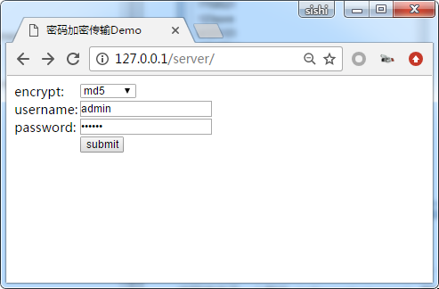
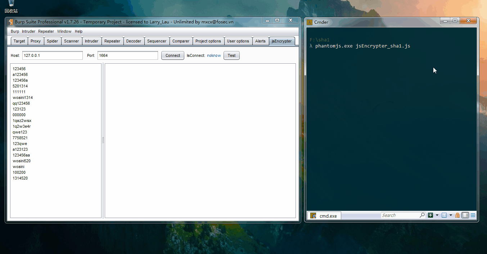
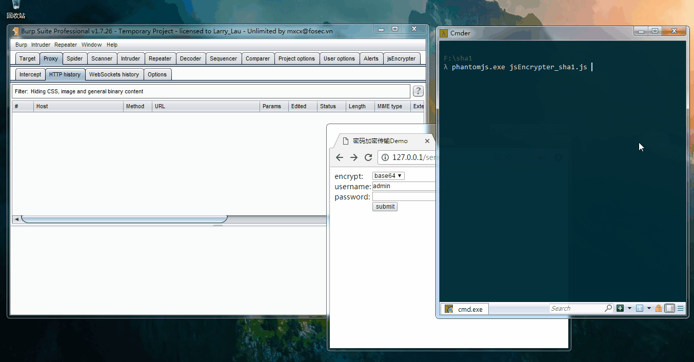

# jsEncrypter
一个用于加密传输爆破的Burp Suite插件

## 编译

该项目依赖包如下：

```
mkdir ./jsEncrypter/lib
cd jsEncrypter/lib 
wget http://central.maven.org/maven2/commons-codec/commons-codec/1.6/commons-codec-1.6.jar
wget http://central.maven.org/maven2/commons-logging/commons-logging/1.1.3/commons-logging-1.1.3.jar
wget http://central.maven.org/maven2/org/apache/httpcomponents/fluent-hc/4.3.6/fluent-hc-4.3.6.jar
wget http://central.maven.org/maven2/org/apache/httpcomponents/httpclient/4.3.6/httpclient-4.3.6.jar
wget http://central.maven.org/maven2/org/apache/httpcomponents/httpclient-cache/4.3.6/httpclient-cache-4.3.6.jar
wget http://central.maven.org/maven2/org/apache/httpcomponents/httpcore/4.3.3/httpcore-4.3.3.jar
wget http://central.maven.org/maven2/org/apache/httpcomponents/httpmime/4.3.6/httpmime-4.3.6.jar
```

导入eclipse中编译

## 安装


## 使用
#### 运行靶机
项目提供了一个靶机（jsEncrypter/server）,靶机提供了7个算法对密码进行加密后传输，后台解密在进行密码匹配。

* base64
* md5
* sha1
* sha254
* sha384
* sha512
* RSA



#### 编写phantomJS运行脚本

`jsEncrypter/js/jsEncrypter_base.js`为插件phantomJS脚本模板。我们只需要将实现加密算法的js文件引入，并在js_crypter函数体共完成对加密函数的调用即可。

````
......
......
......
// 加载实现加密算法的js脚本
var wasSuccessful = phantom.injectJs('xxx.js');/*引入实现加密的js文件*/

// 处理函数
function js_encrypt(payload){
	var newpayload;
	/**********在这里编写调用加密函数进行加密的代码************/

	/**********************************************************/
	return newpayload;
}
......
......
......
````

项目jsEncrypter/server/TestScript目录下是编写好的对应靶机各个加密算法的phantomJS脚本，可以参考！

#### 运行phantomJS并测试


#### 抓包暴力破解

